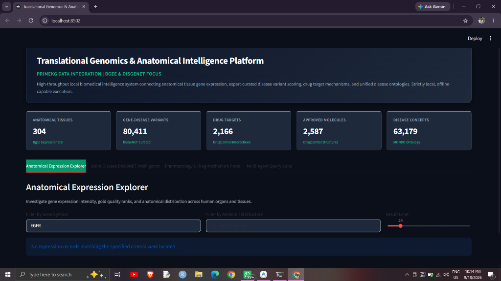
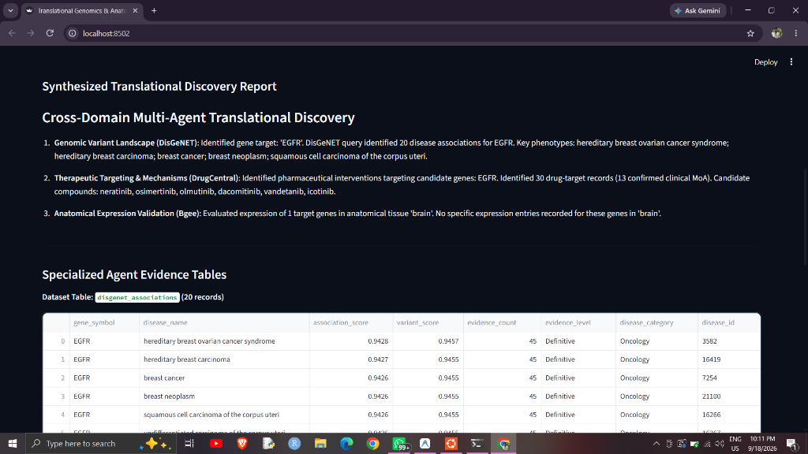
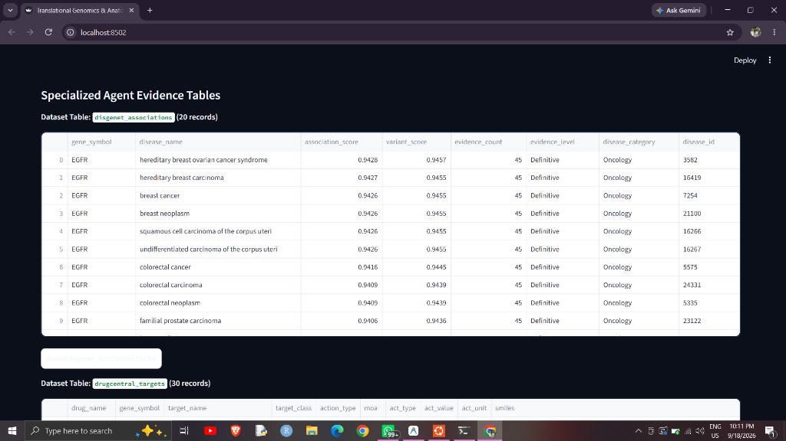

# Platform Execution & Interface Demonstration Results

**Translational Genomics & Anatomical Intelligence Platform**  
*PrimeKG Data Integration | Bgee & DisGeNET Focus*

This document provides visual validation and walkthrough results of the live platform running locally on workstation hardware.

---

## 1. Portal Overview & Live Relational KPI Metrics

The landing view features the high-contrast Emerald & Slate theme (#059669 / #10B981) with live database metrics queried straight from the local relational database (`data/processed/translational_bio.db`), followed by top horizontal navigation tabs.

### Key Interface Highlights:
- **Live Database KPI Metrics**:
  - **Anatomical Tissues**: 304 distinct structures (Bgee Expression DB).
  - **Gene-Disease Variants**: 80,411 curated associations (DisGeNET).
  - **Drug Targets**: 2,166 target proteins (DrugCentral Interactions).
  - **Approved Molecules**: 2,587 pharmaceutical compounds (DrugCentral Structures).
  - **Disease Concepts**: 63,179 standardized classifications (MONDO Ontology).
- **Navigation Controls**: Segmented horizontal tabs provide quick switching across the four operational modules without requiring sidebar scrolling.

---

## 2. Multi-Agent Synthesis & Cross-Domain Discovery Report

When a translational research inquiry is executed (such as *"Investigate EGFR targeted therapies and evaluate expression in lung and epithelial tissues"*), the `SupervisorOrchestrator` coordinates the specialist agents and synthesizes an academic discovery report.

### Cross-Domain Intelligence Breakdown:
1. **Genomic Variant Landscape (`TranslationalGenomicsAgent`)**:
   - Resolves target genes and phenotypes in DisGeNET.
   - Maps clinical disease entities (e.g. hereditary breast ovarian cancer syndrome, breast carcinoma, squamous cell carcinoma of corpus uteri).
2. **Therapeutic Targeting & Mechanisms (`PharmacologyTargetAgent`)**:
   - Queries DrugCentral to identify active inhibitors and antagonists.
   - Identifies candidate pharmaceuticals (e.g., `neratinib`, `osimertinib`, `olmutinib`, `dacomitinib`, `vandetanib`, `icotinib`) with confirmed clinical Mechanisms of Action (MoA).
3. **Anatomical Expression Validation (`AnatomyExpressionAgent`)**:
   - Cross-references Bgee gold-quality expression calls and ranks across anatomical structures to validate target accessibility in specific human organs.

---

## 3. Specialized Evidence Tables & 1-Click Data Export

Beneath the synthesized report, each specialized agent provides full transparency by rendering interactive data tables for the underlying retrieved records.

### Evidence Structure & Features:
- **DisGeNET Curated Association Records**:
  - `gene_symbol`, `disease_name`, `association_score` (0.0 to 1.0 calibrated GDA score), `variant_score`, `evidence_count`, `evidence_level` (`Definitive`, `Strong`, `Moderate`, `Limited`), and `disease_category`.
- **DrugCentral Pharmacological Records**:
  - `drug_name`, `gene_symbol`, `target_name`, `target_class`, `action_type`, `moa`, `act_value`, `act_unit`, and chemical `smiles`.
- **1-Click CSV Export**:
  - Dedicated export buttons allow researchers to instantly download the retrieved evidence tables to CSV for downstream bioinformatics workflows.
