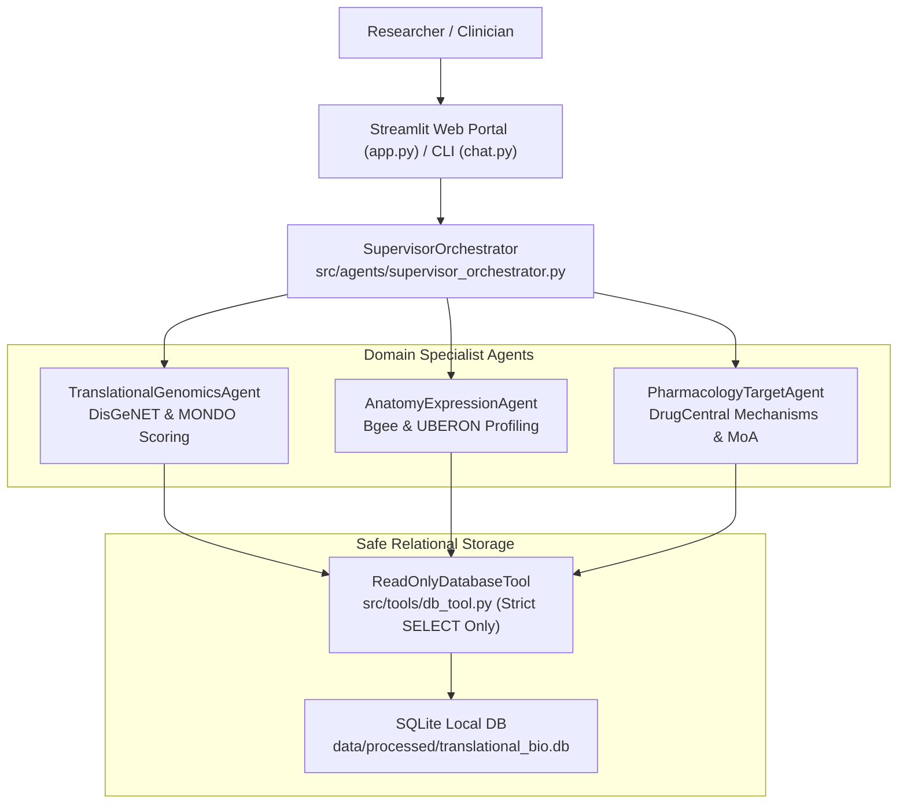

# Translational Genomics & Anatomical Intelligence Platform

**PrimeKG Data Integration | Bgee & DisGeNET Focus**

A 100% local, offline-capable biomedical multi-agent platform designed for translational genomics, target discovery, anatomical expression profiling, and drug repurposing.

The system references the multi-agent design pattern from the AWS cancer biomarker discovery sample while operating entirely locally on workstation hardware using local Python, SQLite/MySQL, and Streamlit. No external cloud services, proprietary APIs, or data egress are used.

---

## Key Highlights

- **Unique Biomedical Datasets (Derived from PrimeKG)**:
  Replaces legacy CTD/SIDER/Reactome combinations with five specialized biomedical resources:
  1. **Bgee**: Anatomical tissue gene expression presence calls and gold-quality ranks.
  2. **DisGeNET**: Expert-curated gene-disease associations and variant impact scores.
  3. **DrugCentral**: Active pharmaceutical ingredients, targets, confirmed mechanisms of action (MoA), and chemical structures.
  4. **MONDO**: Unified disease ontology and clinical classification hierarchy.
  5. **UBERON**: Cross-species anatomical structure ontology.
- **Space-Optimized Streaming Ingestion**:
  Maintains strict disk storage discipline (total raw datasets: 250.48 MB; processed database: 108.54 MB; total footprint: under 360 MB, well below the 3.50 GB ceiling).
- **Emerald & Slate Web Interface**:
  Academic, high-contrast Slate (#0b0f19 / #1e293b) and Emerald Green (#059669 / #10B981) dashboard with top horizontal navigation tabs, live database KPIs, interactive Plotly charts, and 1-click CSV exports.
- **Strict Read-Only Database Security**:
  `src/tools/db_tool.py` enforces connection-level read-only flags (`mode=ro`) and lexical token validation, strictly blocking `INSERT`, `UPDATE`, `DELETE`, `DROP`, `ALTER`, `CREATE`, `TRUNCATE`, and `PRAGMA`.
- **Zero Emoji Compliance**:
  Adheres strictly to a professional, formal academic standard with zero emoji characters anywhere in code, headers, buttons, tabs, logs, or documentation.

---

## Multi-Agent Architecture



### Specialized Agents in `src/agents/`:
1. **`TranslationalGenomicsAgent`**:
   Specializes in DisGeNET curated gene-disease variant scoring, association confidence calibration, MONDO disease classifications, and candidate biomarker ranking.
2. **`AnatomyExpressionAgent`**:
   Specializes in Bgee anatomical expression lookups, gold-quality presence verification, and UBERON anatomical hierarchy mapping.
3. **`PharmacologyTargetAgent`**:
   Specializes in DrugCentral drug mechanisms, active ingredients, molecular action types (Inhibitor, Antagonist, Agonist, Blocker), and chemical representations (SMILES, InChIKey).
4. **`SupervisorOrchestrator`**:
   Coordinates query intent classification, conversational session history management, multi-agent execution routing, and synthesis of cross-domain translational discovery reports.

---

## Project Directory Structure

```
translational_genomics_platform/
├── data/
│   ├── raw/
│   │   ├── bgee_human_expr.tsv.gz            # Bgee expression calls (165.97 MB)
│   │   ├── disgenet_disease_associations.csv # DisGeNET associations (10.68 MB)
│   │   ├── drugcentral_targets.tsv.gz        # DrugCentral targets (761 KB)
│   │   ├── drugcentral_structures.smiles.tsv # DrugCentral chemical structures (1.04 MB)
│   │   ├── mondo.obo                         # MONDO disease ontology (50.67 MB)
│   │   └── uberon.obo                        # UBERON anatomical ontology (21.38 MB)
│   └── processed/
│       ├── translational_bio.db              # High-performance SQLite database (108.54 MB)
│       └── init_translational_db.sql         # Production MySQL 8.0 DDL script
├── src/
│   ├── agents/
│   │   ├── __init__.py
│   │   ├── base_agent.py                     # Abstract BaseAgent with execution logging
│   │   ├── translational_genomics_agent.py   # DisGeNET & MONDO specialist
│   │   ├── anatomy_expression_agent.py       # Bgee & UBERON specialist
│   │   ├── pharmacology_target_agent.py      # DrugCentral mechanisms specialist
│   │   └── supervisor_orchestrator.py        # Central supervisor orchestrator
│   └── tools/
│       ├── __init__.py
│       ├── db_tool.py                        # Strict read-only database execution tool
│       └── query_analyzer.py                 # Entity extraction & intent classifier
├── scripts/
│   ├── download_datasets.py                  # Space-optimized streaming downloader
│   └── parse_and_prepare_data.py             # ETL cleaner & database populator
├── reports/
│   ├── data_inventory.md                     # Exact disk file size audit report
│   ├── data_inventory.csv                    # Tabular dataset metrics & checksums
│   ├── biomarker_scripts_analysis.md         # AWS pattern analysis & local mapping
│   └── mysql_schema_proposal.md              # Normalized relational schema specification
├── app.py                                    # Emerald & Slate Streamlit web dashboard
├── chat.py                                   # Interactive terminal CLI chat interface
├── pyproject.toml                            # Project dependencies and packaging metadata
├── HOW_TO_USE.md                             # Comprehensive execution & operations manual
└── README.md                                 # Project overview and documentation
```

---

## Live Database Inventory

Measurements taken directly from files on disk:

| Biomedical Domain | Database Table | Primary Key | Record Count |
| :--- | :--- | :--- | :--- |
| Anatomical Gene Expression | `bgee_expression` | `id` (AUTOINCREMENT) | 350,000 |
| Translational Disease Genomics | `disgenet_associations` | `id` (AUTOINCREMENT) | 80,411 |
| Pharmacology & Mechanisms | `drugcentral_targets` | `id` (AUTOINCREMENT) | 19,378 |
| Chemical Informatics | `drugcentral_structures` | `struct_id` | 4,099 |
| Unified Disease Ontology | `mondo_ontology` | `mondo_id` | 63,179 |
| Anatomical Structure Ontology | `uberon_ontology` | `uberon_id` | 26,285 |
| **Total Populated Records** | - | - | **543,352** |

---

## Quick Start

### 1. Install Dependencies
```bash
uv sync
```

### 2. Run Web Dashboard
```bash
uv run streamlit run app.py
```
Open `http://localhost:8501` to access the portal.

### 3. Run Interactive CLI
```bash
uv run python chat.py
```
Or run a one-shot query:
```bash
uv run python chat.py --query "Find drugs targeting genes associated with glioblastoma and check their tissue expression in the brain"
```

---

## Verification & Self-Tests

Execute automated security guardrail tests:
```bash
uv run python src/tools/db_tool.py
```
Expected output:
```
Running ReadOnlyDatabaseTool security tests...
  Test 1 Passed: Valid SELECT succeeded.
  Test 2 Passed: INSERT query blocked.
  Test 3 Passed: DROP TABLE blocked.
  Test 4 Passed: UPDATE query blocked.
  Test 5 Passed: Stacked query blocked.
All security tests passed successfully.
```

---

## Technical Documentation Links

- [User Guide & Operations Manual](HOW_TO_USE.md)
- [Data Sources Disk Inventory Report](reports/data_inventory.md)
- [AWS Biomarker Reference Scripts Analysis](reports/biomarker_scripts_analysis.md)
- [Normalized MySQL Schema Proposal](reports/mysql_schema_proposal.md)
