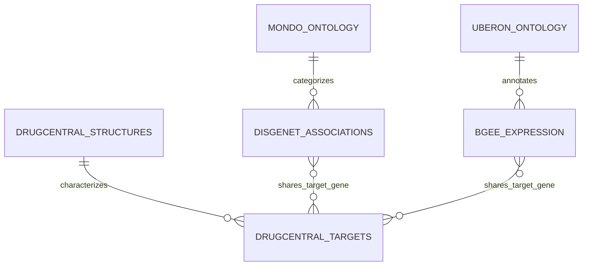

# MySQL and SQLite Normalized Relational Schema Proposal

## Executive Summary

This proposal details the relational architecture implemented for the Translational Genomics and Anatomical Intelligence Platform. The database integrates five primary biomedical repositories (Bgee, DisGeNET, DrugCentral, MONDO, and UBERON) to support multi-agent precision medicine workflows, target discovery, and anatomical expression profiling.

| Database Metric | Value |
| :--- | :--- |
| Local SQLite Engine | SQLite 3.x WAL Mode (`data/processed/translational_bio.db`) |
| Target Relational Engine | MySQL 8.0+ / MariaDB 10.6+ (`data/processed/init_translational_db.sql`) |
| Processed Database Disk Footprint | 108.53 MB (113,799,168 bytes) |
| Character Encoding | UTF-8 / UTF8MB4 Unicode |
| Read-Only Security Mode | Strictly Enforced via `src/tools/db_tool.py` |

---

## Live Table Inventory and Record Counts

| Table Name | Biomedical Domain | Primary Key | Key Index Columns | Populated Record Count |
| :--- | :--- | :--- | :--- | :--- |
| `bgee_expression` | Anatomical Gene Expression | `id` (AUTOINCREMENT) | `gene_name`, `anatomy_name`, `anatomy_id` | 350,000 |
| `disgenet_associations` | Translational Disease Genomics | `id` (AUTOINCREMENT) | `gene_symbol`, `disease_name`, `score` | 80,411 |
| `drugcentral_targets` | Pharmacology and Mechanisms | `id` (AUTOINCREMENT) | `drug_name`, `gene_symbol`, `struct_id` | 19,378 |
| `drugcentral_structures` | Chemical Informatics | `struct_id` | `inn_name`, `inchikey` | 4,099 |
| `mondo_ontology` | Disease Ontology | `mondo_id` | `disease_name` | 63,179 |
| `uberon_ontology` | Anatomical Structure Ontology | `uberon_id` | `anatomy_name` | 26,285 |

---

## Entity-Relationship Architecture



---

## Table Schemas and Design Rationale

### 1. `bgee_expression`
- **Purpose**: Stores anatomical gene expression calls derived from RNA-seq and curated experiments.
- **Fields**: `gene_id`, `gene_name`, `anatomy_id`, `anatomy_name`, `expression_call`, `call_quality`, `fdr`, `expression_score`, `expression_rank`.

### 2. `disgenet_associations`
- **Purpose**: Stores expert-curated gene-disease associations and calibrated variant scores.
- **Fields**: `gene_symbol`, `gene_id`, `disease_id`, `disease_name`, `association_score`, `variant_score`, `evidence_count`, `evidence_level`, `disease_category`.

### 3. `drugcentral_targets`
- **Purpose**: Connects pharmaceutical active ingredients to biological target proteins and mechanisms.
- **Fields**: `drug_name`, `struct_id`, `target_name`, `target_class`, `accession`, `gene_symbol`, `act_value`, `act_type`, `moa`, `action_type`.

### 4. `drugcentral_structures`
- **Purpose**: Chemical structure representations supporting chemoinformatic lookups.
- **Fields**: `struct_id`, `inn_name`, `smiles`, `inchi`, `inchikey`, `cas_rn`.

### 5. `mondo_ontology` and `uberon_ontology`
- **Purpose**: Harmonized hierarchical ontologies for disease entities and anatomical structures.
- **Fields**: `mondo_id`/`uberon_id`, `disease_name`/`anatomy_name`, `definition`, `parent_ids`.

---

## Migration and Deployment Instructions

To migrate the schema to a local MySQL instance:
1. Ensure MySQL 8.0+ is running.
2. Execute the generated DDL:
   ```bash
   mysql -u root -p < data/processed/init_translational_db.sql
   ```
